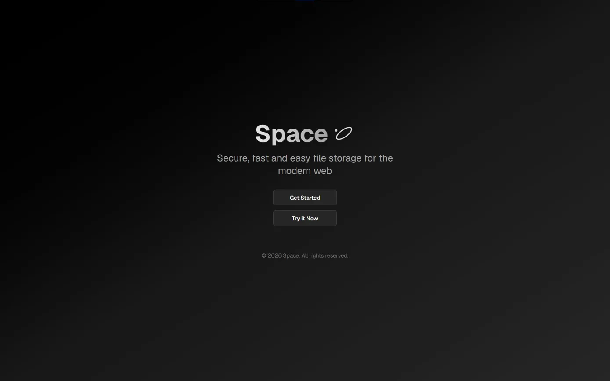
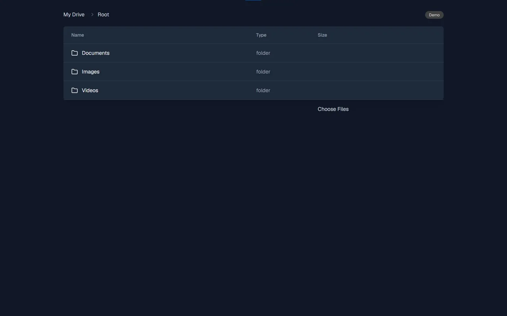

# Space

  
  

## About

A Full Stack cloud storage app for securely storing and managing your files 

## Live Demo

## Features

- **Folder Navigation** — Browse and navigate nested folders with breadcrumb trail
- **File Upload** — Upload files up to 1GB via UploadThing
- **Authentication** — Secure sign in and user management via Clerk
- **File Management** — View and delete files from your drive

## Tech Stack

⚠️ Built as a portfolio project, not intended for commercial use

## License

MIT License

